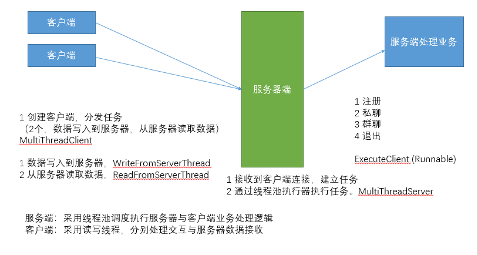

#### 项目名称

    **仿真聊天室**

#### 项目描述：
    支持群聊，单聊的网络聊天室
#### 使用技术：
+ Java基础，
+ Socket编程
+ 多线程
#### 项目功能：
+ 注册
+ 私聊
+ 群聊
+ 退出
#### 项目实现：

+ 服务端：采用线程池调度执行服务器与客户端业务处理逻辑
+ 客户端：采用读写线程，分别处理交互与服务器数据接收
#### 项目总结
+ 掌握了如何从0到1的构建项目思路。（熟悉项目的开发流程：需求->分析->技术选择->设计->编码->测试->打包发布）
+ 掌握了Java网络编程的常用的API和步骤：（基本方法和思路）
+ 了解了多线程的优点，能更加熟练使用多线程
+ 加深maven工具的理解和掌握
#### 优化与扩展
+ 优化点：
    + 参数严格校验
    + 异常信息处理
    + 用户体验（信息展示）
#### 参与项目
+ 克隆项目到本地
    + git clone https://github.com/PuTongFish/chatroom.git
    + cd chatroom
+ 提交项目到仓库
    + git add .
    + git commit -m xxxx
    + git push origin master
